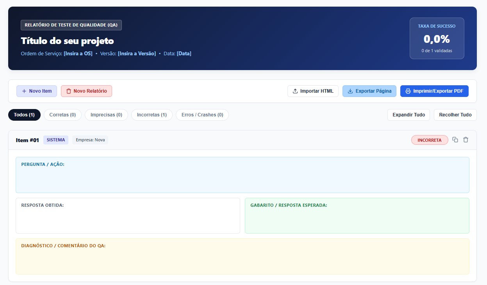
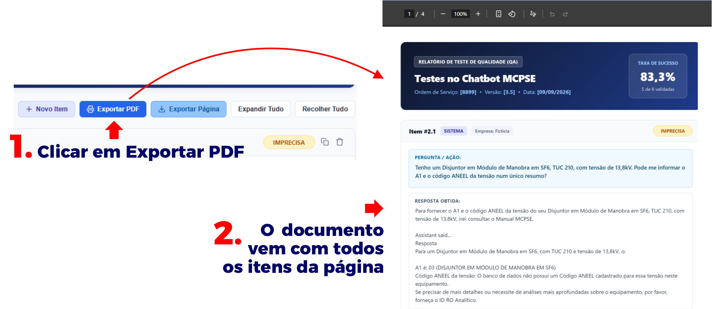

# Painel Interativo de QA (QA Report Dashboard)

> Painel analítico 100% **client-side** (sem dependência de banco de dados ou backend), projetado para auditoria ágil, validação de critérios de aceite e controle de qualidade contínuo em sistemas e fluxos de software.
---

### Visão Geral

# Painel Interativo de QA (QA Report Dashboard)

> Painel analítico 100% **client-side** (sem dependência de banco de dados ou backend), projetado para auditoria, validação de prompts e controle de qualidade contínuo em softwares.

---

### O Problema

A validação manual de testes em sistemas muitas vezes exigem muita organização, esse projeto foi feito com o intuito de facilitar o controle e visualização de um período de testes em software. 

Este projeto consolida o processo de auditoria em uma interface visual focada em produtividade, permitindo avaliar lado a lado:
* **Procedimento realizado**
* **Resposta obtida pelo software**
* **Gabarito / Resposta de referência**

Gera indicadores automáticos de conformidade e relatórios prontos para distribuição executiva.

---

### Principais Recursos

* **Métricas em Tempo Real:** Consolidação automática da taxa de acurácia com base nas classificações (*Correta*, *Imprecisa*, *Incorreta* e *Erro*).
* **Gestão Ágil de Casos:** Criação, duplicação e exclusão rápida de cartões de avaliação.
* **Filtros Segmentados:** Isolamento dinâmico de cards por status crítico (ex.: exibição exclusiva de falhas).
* **Exportação Otimizada para PDF:** Reestruturação de layout via CSS paged media/canvas para entrega do relatório atual, o modelo é gerado no proprio navegador, possibilitando a impressão caso deseje.
* **Portabilidade em Arquivo Único (HTML):** Exportação do estado da sessão em um único arquivo `.html` autossuficiente, preservando total interatividade offline para outros revisores.
* **Importação Otimizada via HTML:** É possível importar relatórios que já foram anteriormente exportados como página de uma forma otimizada, seu relatório vem exatamente da mesma forma que foi exportado, possibilitando editar da onde parou.
* **Suporte PWA:** Instalação nativa em desktop e mobile com funcionamento resiliente via cache.
* **Sanitização de Entrada:** Limpeza automática do clipboard ao colar dados com <kbd>Ctrl</kbd> + <kbd>V</kbd>, prevenindo ruídos de formatação externa.

---

### Demonstração e Uso

Acesse os conteúdos da aplicação:  

#### Fluxo de Trabalho

1. **Entrada:** Crie um novo cartão ou duplique um registro de teste existente.
2. **Dados:** Insira a instrução realizada, o retorno da aplicação e o resultado esperado.
3. **Auditoria:** Selecione o status de validação no seletor correspondente.
4. **Relatório:** Clique em **Exportar PDF** ou salve a versão estática navegável para compartilhamento.

---

### Stack Tecnológica

| Camada | Tecnologia | Aplicação |
| :--- | :--- | :--- |
| **Interface** | HTML5 / CSS3 Moderno | Custom Properties (CSS variables), Grid e Flexbox |
| **Lógica** | JavaScript (Vanilla) | Manipulação direta de DOM e gerenciamento de estado |
| **Offline** | Service Workers (PWA) | Cache inteligente e suporte à instalação do app |
| **Impressão** | html2pdf.js | Conversão client-side de elementos DOM para documento PDF |

---

### Instalação como App (PWA)

A aplicação conta com suporte a **PWA (Progressive Web App)**, permitindo que seja instalada localmente no computador ou celular para abrir em janela própria e funcionar offline:

* **Google Chrome / Microsoft Edge (Desktop):** Clique no ícone de instalação (**Instalar aplicativo** ou monitor com seta para baixo) localizado no lado direito da barra de endereços (URL).
* **Navegadores Mobile (Chrome/Edge no Android):** Toque no menu de três pontos (`⋮`) e selecione **"Adicionar à tela inicial"** ou **"Instalar aplicativo"**.
* **Safari (iOS):** Toque no botão de compartilhamento e escolha **"Adicionar à Tela de Início"**.

> *A localização e o ícone do botão de instalação podem variar levemente de acordo com a versão e o navegador utilizado.*
